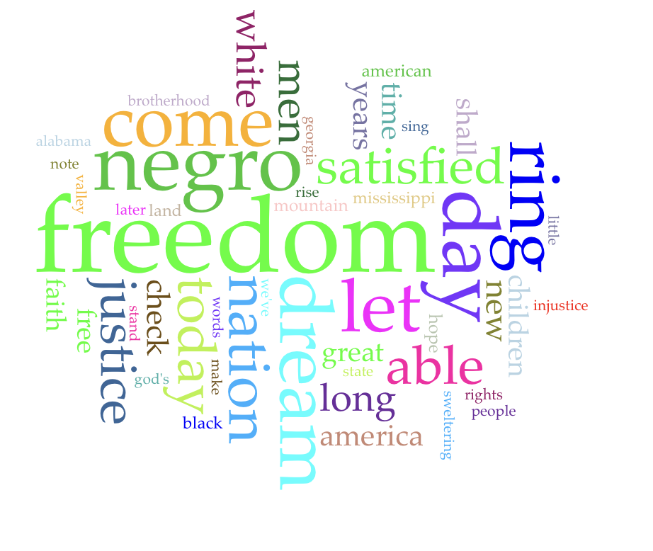



# Distant Reading Assignment 
--- 
I used Voyant to analyze [Martin Luther King Jr.’s “I Have a Dream”](https://www.americanrhetoric.com/speeches/mlkihaveadream.htm)  speech. The tool highlighted the most frequent words, such as freedom, dream, justice, and nation, which reflect the central themes of equality and hope. Voyant allowed me to see the repetition patterns and word frequencies, but it did not explain the emotional power or historical significance of the speech.

 

--- 
When I asked CoPilot, with ChatGPT-5, about the text, it provided summaries of the main themes and contextualized the speech. Here's a few answers I got from our conversation:

“I have a dream that one day this nation will rise up and live out the true meaning of its creed: ‘We hold these truths to be self-evident, that all men are created equal.’”
•	Historical Background: This quote references the Declaration of Independence (1776), which promised equality but excluded enslaved African Americans. In 1963, nearly 100 years after the Emancipation Proclamation (1863), segregation and systemic racism still denied Black Americans equal rights.
•	Meaning: King calls America to honor its founding ideals by ensuring equality for all citizens.
 “I have a dream that my four little children will one day live in a nation where they will not be judged by the color of their skin but by the content of their character.”
•	Historical Background: At the time, Jim Crow laws enforced racial segregation in schools, public spaces, and jobs. King’s children faced a future of discrimination unless change occurred.
•	Meaning: King envisions a society where merit and character—not race—determine opportunity.

From this process, I learned that distant reading tools like Voyant give us quantitative insights into language use, while AI assistants like CoPilot can provide qualitative interpretation. Together, they help us see both patterns and meanings, but they cannot fully capture the cultural or emotional impact that close reading reveals.

